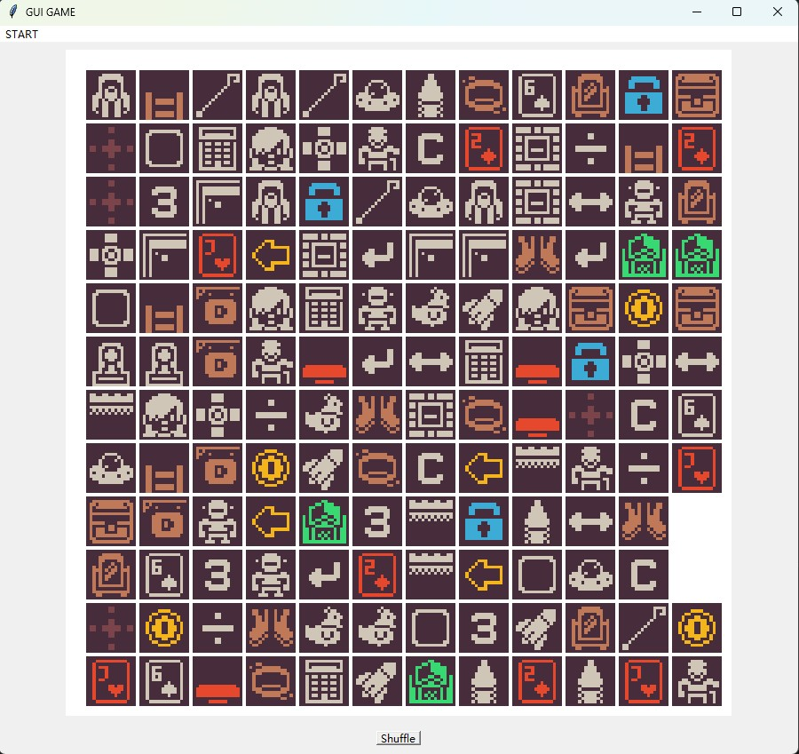

# GUI_game

A simple "Link Game" (连连看) implemented as a learning assignment.  
作为学习作业制作的 **连连看** GUI 游戏  
学習課題として作成した **連連看ゲーム** 

# ゲームの起動方法

コードを実行すると、MainWindowクラスのインスタンスが作成され、ゲームウィンドウが表示されます。メニューバーの「START」から「NEW」を選択すると、ゲームが開始され、アイコンが配置されます。

# ゲームの内容、目的やゴール

内容: ゲームボードは12x12のグリッドで、各セルにはアイコンが配置されています。アイコンの種類はグリッドのサイズに基づき決定されます（ここでは12x12 = 144セルで、アイコンの種類は36種類です）。

目的: 同じアイコンをマッチさせること。アイコン同士をリンクさせるためには、直線リンクまたは角を曲がるリンクが可能です。 全てのアイコンをペアでマッチさせて、ゲームをクリアすることです。

# ゲームの操作方法

クリック: ボード上のアイコンをクリックして選択します。最初にクリックしたアイコンが記録されます。

リンクの確認: 2つ目のアイコンをクリックすると、最初に選んだアイコンとのリンクをチェックします。リンクが成立する場合は、アイコンが消去されます。

終了: すべてのアイコンがペアとしてマッチングされると、ゲームが終了します。

# TuDo

Since the generation is purely random, there are cases where you cannot complete the game. We will create a verification program or add a generation algorithm in the future.

由于生成是纯随机，存在无法完成游戏的情况。以后将会制作验证程序或添加生成算法

生成は完全にランダムのため、ゲームをクリアできない場合があります。検証プログラムや生成アルゴリズムは今後追加される予定です。

